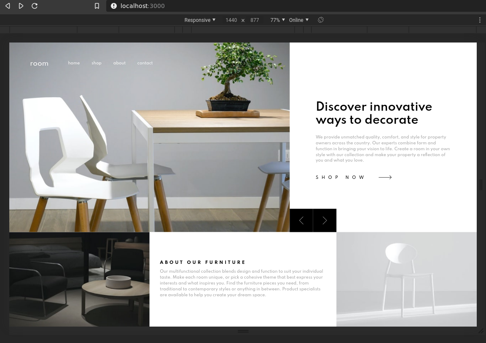
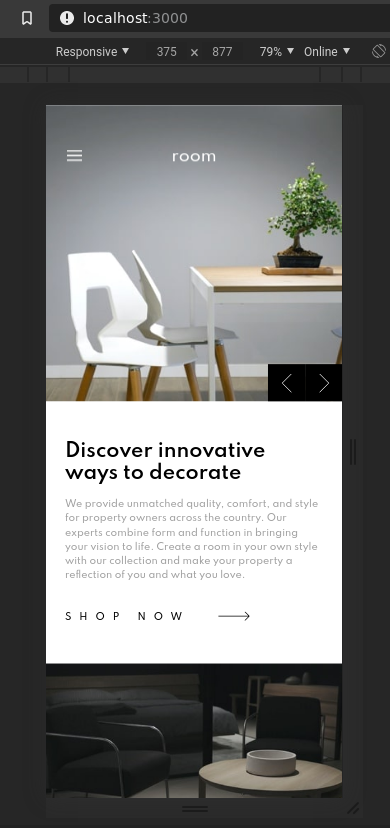

# Frontend Mentor - Room homepage solution

This is my solution to the [Room homepage challenge on Frontend Mentor](https://www.frontendmentor.io/challenges/room-homepage-BtdBY_ENq). 

## Personal note

Having fun using some tech i'm not so comfortable with. 

Trying to build a React skillset, I can read my own code so far, not so bad.

First time CSS in JS flow, not so proud of it at the moment, find it a bit messy and hard to read. If you have any suggestion to clean it up a little bit, do not hesitate.

I had fun implementing the challenge's solution, it's a simple layout but with structural choices on the responsive behaviour. Thanks for that [Frontend mentor](https://www.frontendmentor.io/solutions).

## Overview

### The challenge

Users should be able to:

- View the optimal layout for the site depending on their device's screen size
- See hover states for all interactive elements on the page
- Navigate the slider using either their mouse/trackpad or keyboard

### Screenshot

### Links

- [The challenge](https://www.frontendmentor.io/challenges/room-homepage-BtdBY_ENq)
- [Live solution (coming soon)]()

### Built with

- [React](https://reactjs.org/)
- [React elastic carousel](https://sag1v.github.io/react-elastic-carousel/) - A react carousel 
- [Stitches](https://stitches.dev/) - CSS in JS styling lib